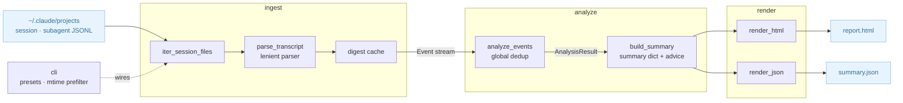

# Architecture

claudeye is a pragmatic-layered Python package. Dependencies flow one way toward
the domain; the CLI wires the pipeline together.

```
claudeye/
  __init__.py    __version__ + public re-exports
  __main__.py    python -m claudeye
  cli.py         argument parsing, run_analyze, main (wiring + user I/O)
  domain/        usage · events · stats · advice     (frozen value objects, read models)
  ingest/        parser · cache · settings           (filesystem adapter)
  analyze/       aggregate · advice · summary         (pure aggregation)
  render/        template · html                      (summary dict -> artifacts)
```



## Layers

- **domain** — pure, dependency-free. Frozen value objects (`Usage`,
  `AdviceConfig`) and mutable read-model accumulators (`SessionStats`,
  `SkillChainStats`, `AnalysisResult`). Nothing here imports the other layers.
- **ingest** — the only filesystem adapter. Discovery (`iter_session_files`),
  lenient parsing (`parse_transcript`, never raising per line — problems become
  `ParseWarning`s), the extraction digest cache, and personal-config loading.
- **analyze** — pure, no I/O. `analyze_events` folds the Event stream into read
  models; `build_summary` freezes them into the summary dict, running the advice
  rules along the way.
- **render** — consumes the summary dict only and produces the self-contained
  HTML and the JSON artifact.
- **cli** — parses arguments and orchestrates ingest → analyze → render, owning
  the only user-facing I/O (stdout, opening the browser).

## Two contracts

1. **Lenient parsing.** The parser never raises on a bad line; it collects a
   `ParseWarning` and moves on, and the warnings surface in the report so the
   reader can judge how much of the corpus the numbers cover.

2. **The summary dict.** `build_summary` returns one plain, JSON-serializable
   dict — the single boundary between analyze and render. Because the report
   embeds exactly this dict, the `--json` artifact and the report's data are
   always identical.

## Global dedup

Session fork/continue copies historical lines verbatim into the new session
file, uuid included (verified against real transcripts). `analyze_events` keeps
one global typed seen-set: `("line", uuid)` counts each physical line once;
`("msg", message_id)` deduplicates streamed usage; `("use"/"res", tool_use_id)`
guards repeated tool blocks. Without this, per-session counting inflated tokens
~8x and tool calls ~6x on the real corpus.

## Digest cache

Second and later runs read a per-file **extraction** digest
(`~/.cache/claudeye/digests`, gzip JSONL, ~1% of the source). Only extraction is
cached, never aggregates — global fork dedup makes aggregates non-composable per
file, so `analyze_events` always re-runs over the cheap digested events. A digest
is keyed by `(mtime_ns, size, parser version, schema)`; any mismatch or defect
re-extracts silently. Measured effect: warm `--all` 15s → 3.4s.
